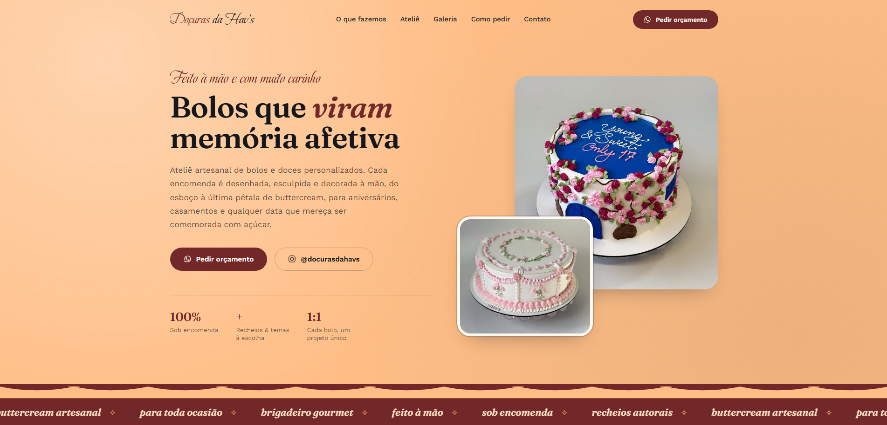

# 🍰 Doçuras da Havs — Landing Page

Landing page moderna e artesanal desenvolvida em React (Vite) para o ateliê de bolos e doces personalizados **Doçuras da Havs** (@docurasdahavs).

---

## 📸 Demonstração do Projeto

  

---

## 🚀 Tecnologias Utilizadas

Este projeto foi construído utilizando tecnologias modernas do ecossistema front-end:

* **Framework/Biblioteca:** React, Vite, JavaScript
* **Estilização:** CSS Modular (com variáveis customizadas, paleta em tons de creme, vinho profundo, dourado e rosa buttercream)
* **Tipografia:** Google Fonts (Fraunces, Beau Rivage e Work Sans)
* **Hospedagem & Deploy:** Vercel

---

## ⚙️ Principais Funcionalidades

* **Design Exclusivo e Confeiteiro:** Elementos visuais personalizados, incluindo divisores em SVG que reproduzem o acabamento de bico de confeitar (`PipedBorder`).
* **Galeria Dinâmica e Filtrável:** Vitrine de produtos organizada por categorias (Aniversário, Casamento, Temáticos, Docinhos & Caixas) com suporte a layouts flexíveis.
* **Seções Estruturadas:** Hero imersivo, carrossel de destaques (Marquee), sobre o ateliê, galeria interativa e seção de etapas de encomenda.
* **Integração Direta com Instagram & WhatsApp:** Atalhos rápidos para contato, conversão e pedidos diretos pelo Instagram (@docurasdahavs) e WhatsApp.